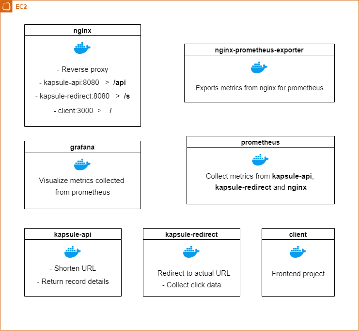
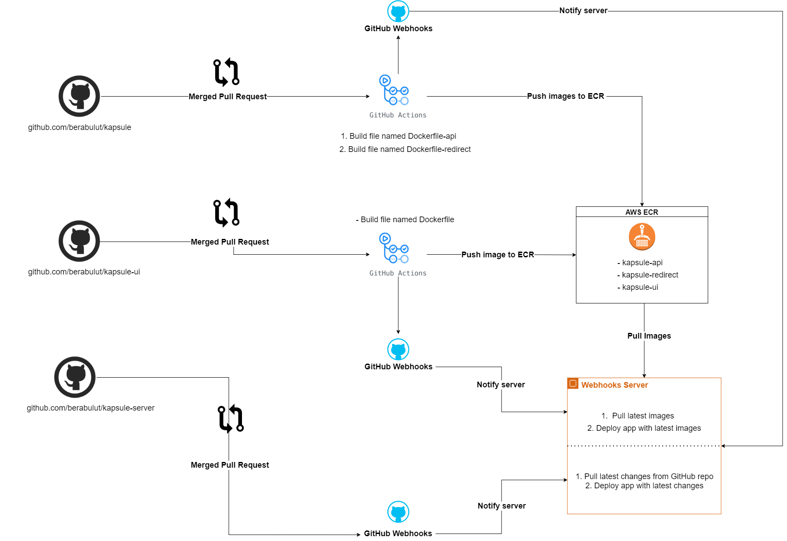

<h1 >kapsule-server</h1>

<div align="center">
  
  <h3>
    <a href="https://kapsule.click/"  target="_blank">
      Live
    </a>
    <span> | </span>
    <a href="https://github.com/berabulut/kapsule-ui"  target="_blank">
      kapsule-ui
     </a>
    <span> | </span>
    <a href="https://github.com/berabulut/kapsule"  target="_blank">
      kapsule
    </a>
  </h3><br>
  Deployment project of 
      <a href="https://github.com/berabulut/kapsule" rel="noopener noreferrer" target="_blank">
      kapsule
    </a> 
</div>


## Structure



## CI / CD




## Local Development

```
docker-compose -f local.yaml build
docker-compose -f local.yaml up
```

## Set up

### Create .env file

`sudo nano .env`

Set this variables

```
AWS_ACCESS_KEY_ID=
AWS_SECRET_ACCESS_KEY=
AWS_ACCOUNT_ID=
AWS_DEFAULT_REGION=eu-central-1
OUTPUT_FORMAT=json

WEBHOOKS_SERVER_PORT=

GF_SECURITY_ADMIN_PASSWORD=
GF_USERS_ALLOW_SIGN_UP=false
```

### Configure AWS CLI

`./aws-config.sh`

## Create SSL Certificate

```
sudo ./init-letsencrypt.sh
```

## Deploy

```
sh deploy.sh
```

## Automatic Update & Build

It basically is a web server that listens [kapsule](https://github.com/berabulut/kapsule), [kapsule-ui](https://github.com/berabulut/kapsule-ui) and this repo. If there are changes web server executes a shell script that deploys application after getting updates.

[**Details**](https://github.com/berabulut/kapsule-server/tree/main/webhooks)

### Set a cron job on Ubuntu instance

`sh add-cronjob.sh`

### Manual way

`crontab -e`

Add this to end of file.

```
*/5 * * * *  cd /home/ubuntu/kapsule-server/webhooks ; ./alive.sh
```

This cron job executes a script (every five minutes) that checks our webhooks server is alive or not. If it's dead it restarts it.
